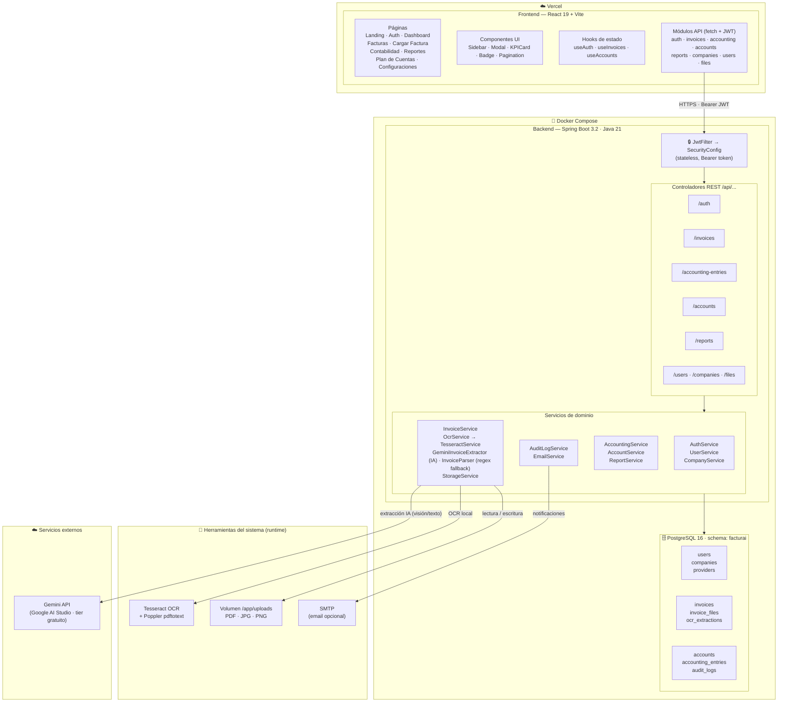
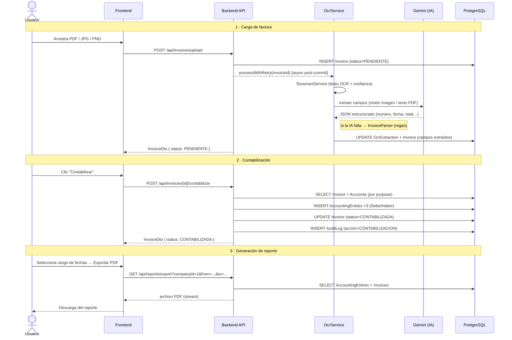
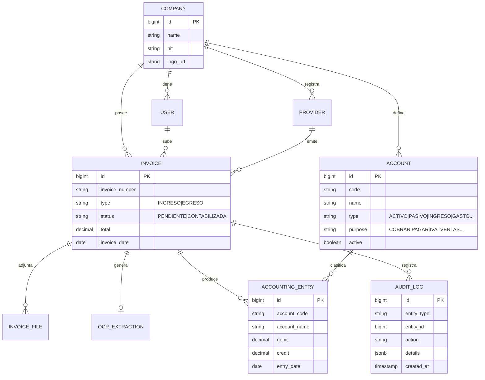

# Karmen — Plataforma Inteligente de Gestión de Facturas

> **Proyecto Integrador I (2554700) — Grupo 001**
> Universidad de Antioquia
> Integrantes: Xiomara Giraldo Pérez · Dina Reales Corredor
> Tutora: Sandra Patricia Zabala Orrego
> Metodología: Scrum — Sprint 0 entregado, Sprint 1 en curso

---

## ¿Qué es Karmen?

Karmen es un sistema web de **gestión contable inteligente** para pequeñas empresas. Automatiza la carga y extracción de datos de facturas mediante OCR + IA, genera asientos contables en doble partida de forma automática, y produce reportes financieros con análisis de IVA e indicadores clave.

### Funcionalidades principales

| Módulo             | Descripción                                                                     |
| ------------------ | ------------------------------------------------------------------------------- |
| **Autenticación**  | Registro de empresa + usuario, login con JWT, rutas protegidas                  |
| **Dashboard**      | KPIs en tiempo real, gráficos de ingresos/egresos (7 meses), facturas recientes |
| **Facturas**       | Listado con filtros, detalle en modal, exportación PDF                          |
| **Cargar Factura** | Drag & drop de PDF/JPG/PNG, extracción OCR simulada, validación manual          |
| **Contabilidad**   | Asientos Debe/Haber generados automáticamente al confirmar factura              |
| **Reportes**       | 4 gráficos (barras, línea, 2 pie charts), cálculo de IVA, métricas financieras  |

---

## Arquitectura

```
karmen/
├── karmen-frontend/     React 19 + Vite                  → http://localhost:5173
├── karmen-backend/      Spring Boot 3.2 + Java 21        → http://localhost:8080
├── karmen-mobile/       Flutter (Android + iOS + Web)    → dispositivos móviles
├── docker-compose.yml   Orquesta backend + BD
├── .env.example         Variables de entorno
└── README.md            (este archivo)
```

### Componentes

| Componente       | Stack                     | Plataformas                   | Documentación               |
| ---------------- | ------------------------- | ----------------------------- | --------------------------- |
| **Frontend Web** | React 19 + Vite           | Web (Chrome, Firefox, Safari) | [README](./karmen-frontend) |
| **Backend API**  | Spring Boot 3.2 + Java 21 | REST + OpenAPI/Swagger        | [README](./karmen-backend)  |
| **Mobile App**   | Flutter + Dart            | Android 21+, iOS 12+, Web     | [README](./karmen-mobile)   |

---

### Diagrama de componentes del sistema



---

---

## Karmen Mobile — Aplicación para dispositivos móviles

La aplicación **Karmen Mobile** extiende la plataforma a dispositivos móviles (Android e iOS) con Flutter, proporcionando funcionalidades de gestión de facturas optimizadas para pantallas pequeñas.

### Características mobile

- ✅ **Autenticación** con JWT y almacenamiento seguro
- ✅ **Carga de facturas** desde cámara o galería
- ✅ **OCR integrado** con timeout de 180 segundos
- ✅ **Contabilización automática** de facturas
- ✅ **Dashboard** con KPIs y reportes en tiempo real
- ✅ **Tema oscuro exclusivo** para mejor UX móvil
- ✅ **Notificaciones push** con Firebase Cloud Messaging
- ✅ **Biometría** (huella dactilar/Face ID)

### Stack mobile

| Aspecto              | Tecnología                  |
| -------------------- | --------------------------- |
| **Framework**        | Flutter 3.3+                |
| **Lenguaje**         | Dart 3.3+                   |
| **State Management** | Flutter Bloc + Riverpod     |
| **Arquitectura**     | Clean Architecture          |
| **Networking**       | Dio con timeouts extendidos |
| **Almacenamiento**   | flutter_secure_storage      |
| **Rutas**            | GoRouter                    |
| **Firebase**         | FCM para notificaciones     |
| **Gráficos**         | fl_chart                    |

### Comenzar con mobile

```bash
cd karmen-mobile
flutter pub get
flutter run -d android        # Android
flutter run -d ios           # iOS
flutter run -d chrome        # Web
```

Documentación completa: [Karmen Mobile README](./karmen-mobile/README.md)

---

### Flujo principal — Procesamiento de una factura



---

### Modelo de entidades (ER simplificado)



---

### Stack tecnológico

**Frontend**

- React 19 (hooks exclusivamente)
- Vite 8 (build tool)
- React Router DOM v7 (navegación + rutas protegidas)
- Recharts (gráficos)
- Fetch nativo
- Fuente Inter (Google Fonts)
- CSS-in-JS con design tokens

**Backend**

- Java 21 (LTS)
- Spring Boot 3.2.4
- Spring Security + JWT (jjwt 0.12.5) — stateless
- Spring Data JPA + Hibernate
- Lombok + MapStruct 1.5.5
- Jakarta Bean Validation
- Maven

**Base de datos**

- PostgreSQL 16
- Schema: `facturai`
- 8 tablas + índices GIN + 2 vistas
- Extensiones: `uuid-ossp`, `pg_trgm`

**Infraestructura**

- Docker + Docker Compose (backend + BD)
- Volúmenes persistentes para datos y archivos subidos

---

## Inicio rápido con Docker (recomendado)

### Requisitos

- Docker Desktop 4.x+
- Node.js 20+ (solo para el frontend)

### 1. Configurar variables de entorno

```bash
cp .env.example .env
# Edita .env si deseas cambiar credenciales o el JWT_SECRET
```

### 2. Levantar base de datos + backend

```bash
docker compose up -d
```

El primer arranque tarda ~2-3 minutos (construye el JAR y aplica el schema SQL).

Verifica que todo esté healthy:

```bash
docker compose ps
```

Deberías ver:

```
NAME          STATUS          PORTS
karmen-db     Up (healthy)    0.0.0.0:5432->5432/tcp
karmen-api    Up              0.0.0.0:8080->8080/tcp
```

### 3. Levantar el frontend

```bash
cd karmen-frontend
npm install
npm run dev
```

Frontend disponible en **http://localhost:5173**

### 3b. (Opcional) Ejecutar app mobile en emulador/web

```bash
cd karmen-mobile
flutter pub get
flutter run -d android         # Android emulator
flutter run -d chrome          # Web browser
```

### 4. Probar la API

```bash
# Registrar usuario
curl -X POST http://localhost:8080/api/auth/register \
  -H "Content-Type: application/json" \
  -d '{"name":"Juan Pérez","nameCompany":"Mi Empresa SAS","username":"juanp","email":"juan@empresa.com","password":"MiClave123!"}'

# Login (obtener JWT)
curl -X POST http://localhost:8080/api/auth/login \
  -H "Content-Type: application/json" \
  -d '{"email":"juan@empresa.com","password":"MiClave123!"}'
```

---

## Inicio sin Docker (desarrollo local)

### Requisitos adicionales

- Java 21
- Maven 3.9+
- PostgreSQL 16

### Base de datos

```bash
# Crear usuario y BD
psql -U postgres -c "CREATE USER karmen_user WITH PASSWORD 'karmen_pass';"
psql -U postgres -c "CREATE DATABASE karmen OWNER karmen_user;"

# Aplicar schema
psql -U karmen_user -d karmen -f karmen-backend/src/main/resources/db/init.sql
```

### Backend

```bash
cd karmen-backend
mvn spring-boot:run
# API en http://localhost:8080
```

### Frontend

```bash
cd karmen-frontend
npm install
npm run dev
# App en http://localhost:5173
```

---

## Comandos Docker útiles

```bash
# Ver logs del backend en tiempo real
docker compose logs -f backend

# Ver logs de la BD
docker compose logs -f postgres

# Detener todo (conserva datos)
docker compose down

# Detener y borrar datos (reset completo)
docker compose down -v

# Reconstruir imagen del backend
docker compose build backend

# Acceder a la BD desde dentro del contenedor
docker exec -it karmen-db psql -U karmen_user -d karmen
```

---

## Endpoints REST

### Autenticación

| Método | Endpoint             | Descripción                      |
| ------ | -------------------- | -------------------------------- |
| `POST` | `/api/auth/register` | Crear cuenta (usuario + empresa) |
| `POST` | `/api/auth/login`    | Login → retorna JWT              |

### Facturas

| Método   | Endpoint                     | Descripción                           |
| -------- | ---------------------------- | ------------------------------------- |
| `GET`    | `/api/invoices?companyId=1`  | Listar facturas (paginado)            |
| `GET`    | `/api/invoices/{id}`         | Detalle de factura                    |
| `POST`   | `/api/invoices/upload`       | Subir archivo + iniciar OCR           |
| `PATCH`  | `/api/invoices/{id}/confirm` | Confirmar datos OCR → genera asientos |
| `DELETE` | `/api/invoices/{id}`         | Eliminar (solo ADMIN)                 |

### Proveedores

| Método   | Endpoint                     | Descripción                 |
| -------- | ---------------------------- | --------------------------- |
| `GET`    | `/api/providers?companyId=1` | Listar proveedores/clientes |
| `POST`   | `/api/providers`             | Crear proveedor             |
| `PUT`    | `/api/providers/{id}`        | Actualizar                  |
| `DELETE` | `/api/providers/{id}`        | Soft delete                 |

### Contabilidad y Reportes

| Método | Endpoint                              | Descripción        |
| ------ | ------------------------------------- | ------------------ |
| `GET`  | `/api/accounting-entries?companyId=1` | Asientos contables |
| `GET`  | `/api/reports/monthly?companyId=1`    | Balance mensual    |
| `GET`  | `/api/reports/export?companyId=1`     | Exportar PDF       |

> Todos los endpoints (excepto `/api/auth/**`) requieren header: `Authorization: Bearer <token>`

---

## Modelo de datos

```
facturai.users           → Usuarios del sistema
facturai.companies       → Empresas (1 por usuario registrado)
facturai.providers       → Proveedores y clientes de la empresa
facturai.invoices        → Facturas (INGRESO / EGRESO)
facturai.invoice_files   → Archivos PDF/JPG/PNG adjuntos
facturai.ocr_extractions → Resultado del procesamiento OCR
facturai.accounting_entries → Asientos contables (Debe/Haber)
facturai.audit_logs      → Log de auditoría de acciones
```

**Lógica de asientos automáticos:**

| Tipo    | Debe                                      | Haber                                     |
| ------- | ----------------------------------------- | ----------------------------------------- |
| INGRESO | Clientes (total)                          | Ingresos (subtotal) + IVA por pagar (tax) |
| EGRESO  | Gastos (subtotal) + IVA acreditable (tax) | Proveedores (total)                       |

---

## Diseño visual (Design Tokens)

| Token    | Valor     | Uso                               |
| -------- | --------- | --------------------------------- |
| `accent` | `#4F46E5` | Sidebar activo, botones primarios |
| `green`  | `#16A34A` | Ingresos, valores positivos       |
| `red`    | `#DC2626` | Egresos, errores                  |
| `purple` | `#7C3AED` | Utilidad bruta                    |
| `orange` | `#F59E0B` | Advertencias, pendientes          |
| `bg`     | `#EEF2F7` | Fondo general                     |

---

## Seguridad

- Contraseñas encriptadas con BCrypt (factor 12)
- JWT en `localStorage` con validación de expiración
- Todos los endpoints protegidos con Bearer token
- DELETE de facturas restringido a rol `ADMIN`
- CORS habilitado solo para `http://localhost:5173`
- Errores en formato `ProblemDetail` (RFC 9457)

---

## OpenAPI / Swagger

La API está completamente documentada con **OpenAPI 3.0** e incluye una interfaz interactiva **Swagger UI** para explorar, entender y probar todos los endpoints sin escribir código.

### 🎯 Acceso a Swagger UI

**URL**: [http://localhost:8080/swagger-ui.html](http://localhost:8080/swagger-ui.html)

Desde Swagger UI puedes:

- ✅ Ver la documentación de todos los endpoints
- ✅ Leer parámetros, respuestas y códigos HTTP
- ✅ Probar requests directamente desde el navegador
- ✅ Copiar ejemplos de `curl` o cliente HTTP

### 🔐 Autenticación en Swagger

1. Haz clic en el botón **"Authorize"** (candado) en la parte superior
2. En **"bearer_jwt (HTTP)"**, pega un token JWT válido obtenido desde:
   ```bash
   curl -X POST http://localhost:8080/api/auth/login \
     -H "Content-Type: application/json" \
     -d '{"email":"admin@karmen.com","password":"Admin123!"}'
   ```
3. Copia el valor del campo `"token"` del response
4. Haz clic en **"Authorize"** → el token se enviará automáticamente en los siguientes requests

### 📄 Documentación JSON

**Especificación completa**: [`http://localhost:8080/v3/api-docs`](http://localhost:8080/v3/api-docs)

Puedes usar esta URL para:

- Integrar con herramientas de generación de código (OpenAPI Generator, etc.)
- Compartir con equipo de frontend/mobile
- Importar en postman: `File → Import → Link → http://localhost:8080/v3/api-docs`

### 📊 Grupos de Endpoints

La documentación agrupa los endpoints por funcionalidad:

| Grupo             | Descripción                     | Endpoints                              |
| ----------------- | ------------------------------- | -------------------------------------- |
| **Autenticación** | Login y registro                | `POST /login`, `POST /register`        |
| **Facturas**      | Gestión de facturas             | 5 endpoints (GET, POST, PATCH, DELETE) |
| **Proveedores**   | Gestión de proveedores/clientes | 5 endpoints (GET, POST, PUT, DELETE)   |
| **Contabilidad**  | Asientos contables              | `GET /accounting-entries`              |
| **Reportes**      | Reportes financieros            | `GET /monthly`, `GET /export`          |

---

## Estructura de carpetas

```
karmen/
├── karmen-frontend/           React web app
│   ├── src/
│   │   ├── api/              Módulos API
│   │   ├── components/       Componentes reutilizables
│   │   ├── pages/            Vistas (Auth, Dashboard, Facturas, etc)
│   │   └── utils/            Utilidades y design tokens
│   └── package.json
│
├── karmen-backend/            Spring Boot REST API
│   ├── src/main/java/com/karmen/api/
│   │   ├── config/           Security, OpenAPI, Exception handlers
│   │   ├── controller/       REST endpoints
│   │   ├── domain/           Entities, repositories
│   │   ├── dto/              Data transfer objects
│   │   ├── security/         JWT, Auth
│   │   └── service/          Business logic
│   └── pom.xml
│
├── karmen-mobile/             Flutter mobile app
│   ├── lib/
│   │   ├── features/         Auth, Facturas, Reportes
│   │   │   ├── domain/       Entities, repositories, usecases
│   │   │   ├── data/         Datasources, models, repositories impl
│   │   │   └── presentation/ Bloc, pages, widgets
│   │   ├── core/             DI, network, storage, theme, errors
│   │   ├── config/           Routes, environment
│   │   ├── app.dart          App root widget
│   │   └── main.dart         Entry point
│   ├── android/              Android native config
│   ├── ios/                  iOS native config
│   ├── test/                 Unit and widget tests
│   ├── pubspec.yaml          Dependencies
│   └── README.md             Mobile documentation
│
├── docker-compose.yml        Orquesta backend + database
├── .env.example             Variables de entorno
└── README.md                Este archivo
```

---

## Metodología — Scrum

| Sprint   | Estado       | Entregables                                                         |
| -------- | ------------ | ------------------------------------------------------------------- |
| Sprint 0 | ✅ Entregado | Diseños Figma/Stitch, arquitectura, modelo de datos                 |
| Sprint 1 | ✅ Entregado | Backend + Frontend funcional, OCR simulado, Docker, OpenAPI/Swagger |
| Sprint 2 | ✅ Entregado | OCR real (Tesseract/Google Vision), reportes PDF                    |
| Sprint 3 | ✅ Entregado | Pruebas, despliegue, documentación final                            |

---

## Credenciales de prueba

| Email                    | Contraseña    | Rol      |
| ------------------------ | ------------- | -------- |
| `admin@karmen.com`       | `Admin123!`   | ADMIN    |
| Cualquier registro nuevo | La que elijas | CONTADOR |

---

_Karmen v0.1.0 — Universidad de Antioquia 2026_
